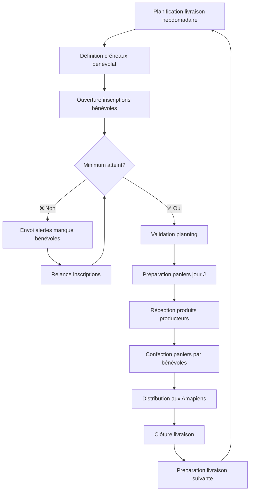
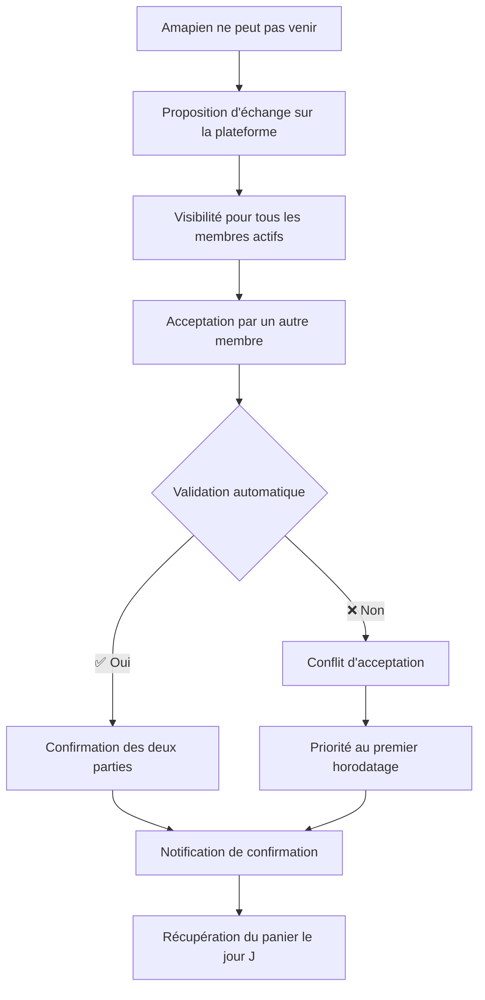

# Fonctionnalités AMAP en ligne

### Vue d'ensemble

L'applicatif facilite l'organisation des livraisons en permettant la planification des créneaux, l'inscription des bénévoles et le suivi des besoins logistiques.

Il centralise les informations sur les contrats et les paniers pour simplifier l'organisation des livraisons.

Le logiciel est open-source et libre (AGPL 3.0), distribué (il peut être installé par qui le souhaite sur son propre serveur, et être ensuite utilisé par les applications clientes de manière transparente).

L'accent est mis sur la sécurisation des données personnelles. 

Des applications clientes Web, Android et iOS (iPhone) sont mises à disposition.

### Acteurs
- **Amapien** : Membre de l'Amap ayant des contrats avec un ou plusieurs producteurs, peut s'inscrire comme bénévole et consulter ses contrats depuis un écran dédié
- **Coordinateur** : Responsable de l'organisation des livraisons, gestion des plannings et suivi des inscriptions. Il a les droits d'administration de son organisation, définit les contrats de saison et peut ensuite les affecter aux Amapiens.
- **Producteur** : Fournisseur de produits (maraîcher, éleveur, boulanger), définit le contenu des paniers  - rôle qui peut également être tenu par un coordinateur
- **Serveur** : Un des serveurs fournissant des données. Amap en ligne met à disposition un serveur par défaut mais il est possible d'installer un autre serveur et de l'utiliser.

### Fonctionnalités principales
1. **Planification des livraisons** : Création et gestion du planning des livraisons
2. **Gestion des bénévoles** : Inscription aux créneaux de préparation avec suivi des minimums requis
3. **Suivi des contrats** : Définition des contrats de saison, affectation aux Amapiens et consultation des engagements pour organiser les paniers
4. **Organisation des paniers** : Définition et suivi des paniers selon les types de contrats et saisons
5. **Échange ponctuel de paniers** : Système d'échange entre membres en cas d'absence
6. **Feuilles d'émargement** : Possibilité de valider les participations et les récupérations de paniers
7. **Demande de récupération de panier par un tiers** : En cas d'imprévu, possibilité de demander un volontaire pour récupérer une commande et venir la chercher plus tard
8. **Gestion des producteurs de l'AMAP** : Interface d'administration permettant soit d'associer un producteur avec compte (*ProducerAccount*), soit de créer un producteur sans compte géré par l'AMAP, de définir les produits (*Product*) qu'il apporte, de modifier cette sélection, de gérer son statut (actif, suspendu, terminé) et de lier ultérieurement un producteur sans compte à un compte existant
9. **Templates de livraison avec créneau anticipé** : L'admin de l'organisation définit des modèles réutilisables de livraison (*DELIVERY_TEMPLATE*) pouvant inclure un créneau anticipé (*EARLY_SLOT*) — heure d'arrivée avancée, explication et nombre max de volontaires — permettant à certains bénévoles d'arriver plus tôt pour réceptionner les produits. Le coordinateur sélectionne un template existant lors de la création d'une livraison et peut surcharger le créneau anticipé pour cette livraison uniquement. Lors de l'inscription, si un créneau anticipé est disponible, l'Amapien voit deux options d'inscription directement affichées sur l'écran planning sans dialog intermédiaire.
10. **Spécialisation des coordinateurs par contrat** : Les coordinateurs (*COORDINATOR*) peuvent se spécialiser sur un ou plusieurs contrats de saison (*CONTRACT*) — par exemple un binôme légumes et un coordinateur pain. Chaque livraison-contrat (*DELIVERY_CONTRACT*) reçoit la liste des coordinateurs qui prennent en charge ce produit pour cette livraison précise : ils peuvent s'auto-affecter via `[ME PORTER COORDINATEUR]`, et un admin peut affecter n'importe quel coordinateur de l'AMAP. Une livraison ne peut pas passer en statut `CONFIRMED` tant qu'une de ses livraisons-contrats n'a pas au moins un coordinateur. Les coordinateurs apparaissent sur le planning Amapien, sur les cartes de prochaines livraisons et sur l'écran de suivi de livraison, avec un lien `tel:` lorsque le numéro est renseigné. Voir [ADR-004](../../architecture/adr-004-coordinator-assignment.md).

## Processus d'organisation des livraisons

### Workflow principal

**Description du processus :** Le cycle commence par la planification de la livraison et la définition des créneaux de bénévolat nécessaires. 

Les Amapiens s'inscrivent comme bénévoles jusqu'à atteindre le minimum requis défini. 
Le jour de la livraison, les bénévoles confectionnent les paniers selon les contrats établis et organisent la distribution. 
Le processus se répète suivant la fréquence souhaitée (en général hebdomadaire).

## Échange de paniers

L'échange de paniers permet aux membres de gérer leurs absences au mieux.

### Processus d'échange

**Description du processus :** Un membre propose son panier à l'échange jusqu'à 2h avant la livraison. Les autres membres voient la proposition et peuvent l'accepter selon leurs besoins. Le système gère automatiquement les priorités et confirme l'échange aux deux parties.

### Règles de fonctionnement
- **Délai limite** : Propositions possibles jusqu'à 2h avant la livraison
- **Compteurs par volontaire** : Permet de vérifier que la répartition des paniers échangés est équilibrée 
- **Transparence** : Historique complet des échanges pour chaque membre

## Spécifications fonctionnelles

> **📋 Spécifications détaillées** : Les traitements fonctionnels complets par profil utilisateur sont détaillés dans `specifications-detaillees.md`.

> **📋 Règles métier** : Les contraintes et principes de fonctionnement sont définis dans `regles-metier.md`.

### Interface Utilisateur

> **📋 Spécifications détaillées** : Les spécifications complètes de l'interface utilisateur sont détaillées dans `ui/spec-ui.md`.

L'interface s'organise autour de plusieurs vues principales :

- **Planning participatif** : Interface d'inscription aux livraisons et de gestion des échanges accessible aux Amapiens
- **Tableau de bord livraisons** : Vue globale des livraisons, alertes et statistiques
- **Mes contrats** : Interface dédiée permettant à l'Amapien de consulter ses contrats, leur état et leurs dates utiles — voir [`ui/member/screen-member-04-contracts.md`](ui/member/screen-member-04-contracts.md)
- **Participations globales** : Vue anonymisée du positionnement de l'Amapien dans la dynamique de participation de son AMAP sur la saison courante — voir [`ui/member/screen-member-05-participations-globales.md`](ui/member/screen-member-05-participations-globales.md)
- **Contrats de saison** : Interface coordinateur de consultation, création et modification des contrats utilisés par l'AMAP — voir [`ui/coordinator/screen-coordinator-09-contract-definition.md`](ui/coordinator/screen-coordinator-09-contract-definition.md)
- **Gestion des utilisateurs et contrats** : Interface de gestion permettant au coordinateur d'affecter un ou plusieurs contrats à un Amapien et de retirer un contrat — voir [`ui/coordinator/screen-coordinator-08-member-contracts.md`](ui/coordinator/screen-coordinator-08-member-contracts.md)
- **Gestion des producteurs** : Interface d'administration permettant d'associer un producteur avec compte ou de créer un producteur sans compte géré par l'AMAP, incluant la sélection/édition des produits apportés, le suivi du statut de chaque association et la liaison ultérieure vers un compte producteur — voir `ui/admin/screen-admin-04-producer-management.md`
- **Catalogue d'items** : Définition des items (*ItemType*) composant les paniers d'un type de produit — voir [`ui/producer/screen-producer-03-item-catalog.md`](ui/producer/screen-producer-03-item-catalog.md)
- **Description de livraison** : Consultation et saisie du contenu d'une livraison par taille de panier, accessible depuis les perspectives producteur et coordinateur — voir [`ui/common/screen-common-03-delivery-description.md`](ui/common/screen-common-03-delivery-description.md)

### Références

### Documentation liée
- **Architecture** : `../architecture/data-model.md` - Définitions des entités techniques DELIVERY, DELIVERY_CONTRACT, MEMBER_SLOT, PRODUCT_TYPE, CONTRACT, MEMBER_CONTRACT
- **Spécifications détaillées** : `specifications-detaillees.md` - Traitements fonctionnels par profil utilisateur
- **Règles métier** : `regles-metier.md` - Contraintes et principes de fonctionnement
- **Interface utilisateur** : `ui/spec-ui.md` - Spécifications détaillées des écrans et interactions

> **📋 Note terminologique** : Les noms d'entités techniques (DELIVERY, DELIVERY_CONTRACT, DELIVERY_TEMPLATE, EARLY_SLOT, MEMBER_SLOT, PRODUCT_TYPE, CONTRACT, MEMBER_CONTRACT) suivent la nomenclature anglaise du modèle de données pour assurer la cohérence avec l'implémentation technique. Le modèle sépare désormais la définition des produits (PRODUCT_TYPE) des contrats de saison (CONTRACT) et des engagements individuels (MEMBER_CONTRACT). Les créneaux de bénévolat (MEMBER_SLOT) sont liés aux contrats de livraison (DELIVERY_CONTRACT) pour une gestion précise des besoins par contrat membre. Le modèle de livraison réutilisable (DELIVERY_TEMPLATE) peut optionnellement définir un créneau anticipé (EARLY_SLOT) permettant à certains bénévoles d'arriver avant l'heure habituelle. Chaque livraison-contrat (DELIVERY_CONTRACT) porte une liste de coordinateurs (COORDINATOR) responsables de la distribution du produit concerné pour cette livraison.
