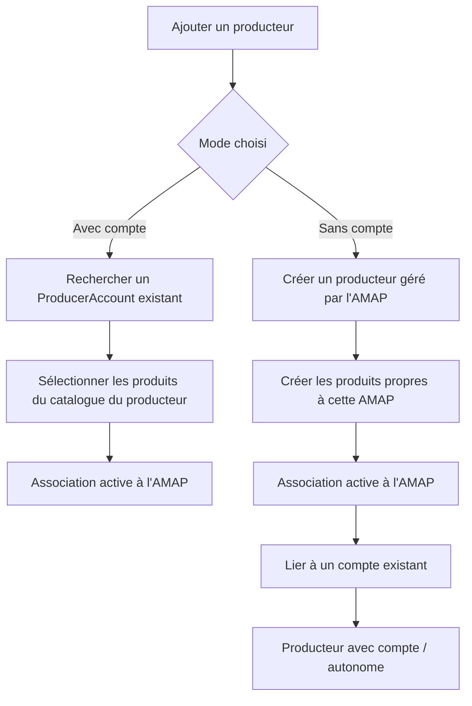

# Gestion des producteurs de l'AMAP

## Description

Interface réservée aux administrateurs de l'AMAP permettant de gérer les producteurs associés à leur organisation (*OrganizationProducer*).

L'écran couvre explicitement deux modes de gestion d'un producteur :

- **Producteur avec compte** : producteur disposant d'un compte (*ProducerAccount*) et gérant ensuite son activité de manière autonome.
- **Producteur sans compte** : producteur créé par l'AMAP pour un usage local, sans accès à l'interface, avec produits gérés par l'AMAP.

Le cycle de vie documenté ici comprend :

1. l'inscription d'un producteur **avec compte** existant ;
2. la création d'un producteur **sans compte** ;
3. l'édition des produits pour les producteurs **avec compte** ;
4. la consultation en lecture seule d'un producteur **sans compte** après son affectation à l'AMAP.

> **📋 Parcours utilisateur** : l'ajout d'un producteur se fait toujours en 2 étapes : **identité du producteur**, puis **produits apportés à l'AMAP**. Le contenu exact de chaque étape dépend du mode choisi.

---

## Cycle de vie fonctionnel



---

## Wireframe — Liste des producteurs

```
┌──────────────────────────────────────────────────────────────────────┐
│  🥕 Admin · Producteurs de l'AMAP                                    │
├──────────────────────────────────────────────────────────────────────┤
│  ← Tableau de bord admin                                             │
├──────────────────────────────────────────────────────────────────────┤
│                                                                      │
│  🌿 Producteurs associés à l'AMAP                                    │
│                                                                      │
│  Statut : [ACTIFS ▼]   Mode : [TOUS ▼]   [+ Ajouter un producteur]   │
│                                                                      │
│  ┌──────────────────────────────────────────────────────────────┐    │
│  │ Producteur          Mode            Produits   Depuis  Statut │    │
│  ├──────────────────────────────────────────────────────────────┤    │
│  │ Ferme des Lilas     AVEC COMPTE     3         03/2024 ACTIF  │    │
│  │ contact@lilas.fr    AUTONOME                  [Voir →] [···] │    │
│  ├──────────────────────────────────────────────────────────────┤    │
│  │ Verger du Bourg     SANS COMPTE     2         09/2024 ACTIF  │    │
│  │ contact saisi AMAP  GÉRÉ PAR L'AMAP          [Voir →] [···]  │    │
│  ├──────────────────────────────────────────────────────────────┤    │
│  │ Boulangerie Bio     AVEC COMPTE     1         01/2025 SUSP.  │    │
│  │ bio@boulangerie.fr  AUTONOME                  [Voir →] [···] │    │
│  └──────────────────────────────────────────────────────────────┘    │
│                                                                      │
│  2 actifs · 1 suspendu                                               │
│                                                                      │
└──────────────────────────────────────────────────────────────────────┘
```

---

## Wireframe — Détail d'un producteur

```
┌──────────────────────────────────────────────────────────────────────┐
│  🥕 Admin · Verger du Bourg                                          │
├──────────────────────────────────────────────────────────────────────┤
│  ← Retour à la liste                                                 │
├──────────────────────────────────────────────────────────────────────┤
│                                                                      │
│  🟢 ACTIF · SANS COMPTE · GÉRÉ PAR L'AMAP · Associé depuis 15/03/2024 │
│                                                                      │
│  ┌──────────────────────────────────────────────────────────────┐    │
│  │  🌿 PRODUCTEUR                                               │    │
│  │                                                              │    │
│  │  Nom              Verger du Bourg                            │    │
│  │  Email            contact@vergerbourg.fr                     │    │
│  │  Téléphone        06 00 00 00 00                             │    │
│  │  Site             —                                          │    │
│  │  Compte           Aucun compte lié                           │    │
│  └──────────────────────────────────────────────────────────────┘    │
│                                                                      │
│  ┌──────────────────────────────────────────────────────────────┐    │
│  │  🛒 PRODUITS APPORTÉS À L'AMAP                    [Modifier] │    │
│  │                                                              │    │
│  │  Pommes                                                      │    │
│  │    Paniers : 1 kg · 2 kg                                     │    │
│  │                                                              │    │
│  │  Jus de pomme                                                │    │
│  │    Paniers : Bouteille 1L                                    │    │
│  └──────────────────────────────────────────────────────────────┘    │
│                                                                      │
│  ℹ️  Ce producteur est géré par l'AMAP.                              │
│      Sa fiche et ses produits sont en lecture seule.                 │
│                                                                      │
│  ───────────────────────────────────────────────────────────────     │
│  [SUSPENDRE]                  [METTRE FIN À L'ASSOCIATION]           │
│                                                                      │
└──────────────────────────────────────────────────────────────────────┘
```

Pour un producteur **avec compte**, le bloc d'identité affiche le compte lié et le bandeau de liaison n'est pas affiché.

---

## Wireframe — Ajout d'un producteur — Étape 1 : identité du producteur

```
┌──────────────────────────────────────────────────────────────────────┐
│  🥕 Admin · Ajouter un producteur                                    │
├──────────────────────────────────────────────────────────────────────┤
│  ← Annuler                                                           │
├──────────────────────────────────────────────────────────────────────┤
│                                                                      │
│  Étape 1 sur 2 — Identité du producteur                              │
│                                                                      │
│  ┌──────────────────────────────────────────────────────────────┐    │
│  │  1. Associer un producteur avec compte                       │    │
│  │                                                              │    │
│  │  🔍 Rechercher par nom ou email                              │    │
│  │  [ferme...__________________________________________]        │    │
│  │                                                              │    │
│  │  Ferme des Collines · collines@ferme.fr  [Choisir ce producteur] │
│  │  Ferme Arc-en-Ciel · arc@ferme.fr      [Choisir ce producteur]   │
│  └──────────────────────────────────────────────────────────────┘    │
│                                                                      │
│  ───────────────────────── ou ────────────────────────────────       │
│                                                                      │
│  ┌──────────────────────────────────────────────────────────────┐    │
│  │  2. Créer un producteur sans compte                          │    │
│  │                                                              │    │
│  │  Nom du producteur *                                         │    │
│  │  [Verger du Bourg____________________________________]       │    │
│  │                                                              │    │
│  │  Email de contact (optionnel)                                │    │
│  │  [contact@vergerbourg.fr_____________________________]       │    │
│  │                                                              │    │
│  │  Téléphone (optionnel)                                       │    │
│  │  [06 00 00 00 00____________________________________]       │    │
│  │                                                              │    │
│  │  Site web (optionnel)                                        │    │
│  │  [____________________________________________________]      │    │
│  │                                                              │    │
│  │                                      [Continuer sans compte] │    │
│  └──────────────────────────────────────────────────────────────┘    │
│                                                                      │
└──────────────────────────────────────────────────────────────────────┘
```

---

## Wireframe — Ajout d'un producteur avec compte — Étape 2 : sélection des produits

```
┌──────────────────────────────────────────────────────────────────────┐
│  🥕 Admin · Ajouter — Ferme des Collines                            │
├──────────────────────────────────────────────────────────────────────┤
│  ← Étape précédente                                                  │
├──────────────────────────────────────────────────────────────────────┤
│                                                                      │
│  Étape 2 sur 2 — Choisir les produits                                │
│                                                                      │
│  Mode : AVEC COMPTE · AUTONOME                                       │
│                                                                      │
│  Sélectionnez les produits du catalogue du producteur :              │
│                                                                      │
│  ┌──────────────────────────────────────────────────────────────┐    │
│  │  ☑ Légumes de saison                                         │    │
│  │    Tailles disponibles : ☑ Petit  ☑ Moyen  ☐ Grand          │    │
│  │                                                              │    │
│  │  ☑ Fruits de saison                                          │    │
│  │    Tailles disponibles : ☑ Moyen  ☑ Grand                   │    │
│  │                                                              │    │
│  │  ☐ Confiture                                                 │    │
│  │    Tailles disponibles : ☐ Pot 250g  ☐ Pot 500g             │    │
│  └──────────────────────────────────────────────────────────────┘    │
│                                                                      │
│  Au moins un produit doit être sélectionné.                          │
│                                                                      │
│  [ANNULER]                          [CONFIRMER L'AJOUT DU PRODUCTEUR]│
│                                                                      │
└──────────────────────────────────────────────────────────────────────┘
```

---

## Wireframe — Ajout d'un producteur sans compte — Étape 2 : produits gérés par l'AMAP

```
┌──────────────────────────────────────────────────────────────────────┐
│  🥕 Admin · Ajouter — Verger du Bourg                               │
├──────────────────────────────────────────────────────────────────────┤
│  ← Étape précédente                                                  │
├──────────────────────────────────────────────────────────────────────┤
│                                                                      │
│  Étape 2 sur 2 — Définir les produits                                │
│                                                                      │
│  Mode : SANS COMPTE · GÉRÉ PAR L'AMAP                                │
│                                                                      │
│  Les produits créés ici sont propres à cette AMAP.                   │
│                                                                      │
│  [Ajouter un produit]                                                │
│                                                                      │
│  ┌──────────────────────────────────────────────────────────────┐    │
│  │  Pommes                                   [Modifier] [Supprimer] │
│  │  Paniers : 1 kg · 2 kg                                        │    │
│  ├──────────────────────────────────────────────────────────────┤    │
│  │  Jus de pomme                             [Modifier] [Supprimer] │
│  │  Paniers : Bouteille 1L                                      │    │
│  └──────────────────────────────────────────────────────────────┘    │
│                                                                      │
│  Au moins un produit avec au moins une taille de panier est requis.  │
│                                                                      │
│  [ANNULER]                          [CONFIRMER L'AJOUT DU PRODUCTEUR]│
│                                                                      │
└──────────────────────────────────────────────────────────────────────┘
```

L'action **[Ajouter un produit]** ouvre un formulaire permettant de saisir :

- **Nom du produit** ;
- **une ou plusieurs tailles de panier** affichées aux membres.

---

## Navigation et interactions

### Écran liste

| Action | Comportement |
|--------|-------------|
| Filtre statut | Filtre la liste par `ACTIVE`, `SUSPENDED`, `TERMINATED` |
| Filtre mode | Filtre la liste par **Tous**, **Avec compte**, **Sans compte** |
| [Voir →] | Navigue vers le détail du producteur |
| [···] | Menu contextuel : Suspendre · Réactiver · Mettre fin à l'association |
| [+ Ajouter un producteur] | Lance le parcours d'ajout en 2 étapes |

### Détail producteur

| Action | Comportement |
|--------|-------------|
| [Modifier] | Visible uniquement pour un producteur **avec compte** ; ouvre l'étape 2 pré-remplie avec les produits actuels |
| [SUSPENDRE] | Passe le statut à `SUSPENDED` ; confirmation demandée avant envoi |
| [RÉACTIVER] | Passe le statut à `ACTIVE` (visible uniquement si statut `SUSPENDED`) |
| [METTRE FIN À L'ASSOCIATION] | Passe le statut à `TERMINATED` ; modal de confirmation |

### Ajout — Étape 1

| Action | Comportement |
|--------|-------------|
| Saisie de recherche | Recherche en temps réel dans les `ProducerAccount` actifs non encore associés à cette AMAP |
| [Choisir ce producteur] | Passe à l'étape 2 en mode **avec compte** |
| [Continuer sans compte] | Passe à l'étape 2 en mode **sans compte** avec les informations saisies |

### Ajout / modification — Étape 2 avec compte

| Action | Comportement |
|--------|-------------|
| Sélection des produits | L'admin coche les produits du catalogue du producteur et choisit les `BasketSize` à activer dans l'AMAP |
| [CONFIRMER L'AJOUT DU PRODUCTEUR] | Crée l'association et les `Product` de l'AMAP à partir du catalogue du producteur |
| [Enregistrer les modifications] | Remplace la sélection actuelle des produits de cette association |

### Ajout / modification — Étape 2 sans compte

| Action | Comportement |
|--------|-------------|
| [Ajouter un produit] | Ouvre le formulaire de création d'un produit propre à cette AMAP |
| [Modifier] | Permet de changer le nom du produit et ses tailles de panier |
| [Supprimer] | Retire le produit de la liste courante ; confirmation demandée |
| [CONFIRMER L'AJOUT DU PRODUCTEUR] | Crée le producteur sans compte et sa liste de produits dans l'AMAP |
| Après création | La fiche du producteur sans compte devient **lecture seule** pour l'admin ; seules les actions de statut restent disponibles |

---

## États de l'interface

### Badges de statut

| Statut (`OrganizationProducerStatus`) | Icône | Libellé affiché |
|--------------------------------------|-------|-----------------|
| `ACTIVE` | 🟢 | ACTIF |
| `SUSPENDED` | 🟡 | SUSPENDU |
| `TERMINATED` | 🔴 | TERMINÉ |

### Badges de mode

| Mode | Libellé principal | Libellé secondaire |
|------|-------------------|--------------------|
| Producteur avec compte | AVEC COMPTE | AUTONOME |
| Producteur sans compte | SANS COMPTE | GÉRÉ PAR L'AMAP |

### Boutons d'action selon le mode et le statut

| Mode | Statut actuel | Boutons disponibles |
|------|---------------|---------------------|
| Avec compte | `ACTIVE` | [Modifier] · [SUSPENDRE] · [METTRE FIN À L'ASSOCIATION] |
| Avec compte | `SUSPENDED` | [Modifier] · [RÉACTIVER] · [METTRE FIN À L'ASSOCIATION] |
| Sans compte | `ACTIVE` | [SUSPENDRE] · [METTRE FIN À L'ASSOCIATION] |
| Sans compte | `SUSPENDED` | [RÉACTIVER] · [METTRE FIN À L'ASSOCIATION] |
| Tous modes | `TERMINATED` | Aucune action ; lecture seule |

### Cas limites

| Situation | Message affiché |
|-----------|----------------|
| Aucun producteur associé | « Aucun producteur. Ajoutez votre premier producteur. » |
| Aucun résultat de recherche pour un compte | « Aucun producteur avec compte trouvé. Vérifiez le nom ou l'adresse email. » |
| Producteur avec compte sans catalogue produit | « Ce producteur n'a pas encore défini de catalogue produits. » — [Choisir ce producteur] désactivé |
| Création sans compte avec doublon actif/suspendu dans la même AMAP | « Un producteur portant déjà ce nom ou cet email existe dans cette AMAP. Ouvrez la fiche existante pour le modifier. » |
| Aucun produit défini à l'étape 2 | « Ajoutez au moins un produit avec au moins une taille de panier. » |
| Chargement en cours | Spinner inline ; boutons de confirmation désactivés |

---

## Règles métier

- Seuls les rôles `ADMIN` et `OWNER` peuvent accéder à cet écran.
- Un `ProducerAccount` avec `activeStatus = false` n'apparaît ni dans les résultats d'ajout, ni dans les résultats de liaison.
- Un producteur déjà associé à l'AMAP avec le statut `ACTIVE` ou `SUSPENDED` n'apparaît pas dans les résultats d'ajout ou de liaison.
- La suppression physique d'un `OrganizationProducer` n'est pas possible ; le statut passe à `TERMINATED`. Les produits restent visibles en lecture seule.
- **Producteur avec compte** : l'admin peut uniquement sélectionner ou désélectionner les produits du catalogue du producteur ; il ne crée pas de nouveau produit depuis cet écran.
- **Producteur sans compte** : l'admin peut créer, renommer et supprimer les produits de ce producteur dans la limite de l'AMAP courante.
- Un producteur **sans compte** appartient à une seule AMAP. Il n'est jamais réutilisable tel quel dans une autre AMAP.
- Les produits d'un producteur **sans compte** appartiennent à cette même AMAP uniquement. Ils ne sont ni mutualisés ni visibles dans une autre AMAP.
- Pour chaque produit retenu, au moins une `BasketSize` doit être sélectionnée.
- L'ajout ou la modification des produits remplace intégralement la liste courante de produits pour cette association.
- La liaison d'un producteur sans compte vers un producteur avec compte est **explicite** : aucune correspondance automatique sur le nom, l'email ou le téléphone n'est autorisée.
- Une liaison conserve l'historique de l'association, le statut courant et les produits actuellement actifs dans l'AMAP ; le producteur sans compte cesse ensuite d'exister comme entrée distincte.
- Une fois la liaison confirmée, le producteur passe en mode **avec compte / autonome**. Aucun retour en mode **sans compte** n'est prévu depuis l'interface.
- L'`associationInstant` est fixé à la date/heure de confirmation initiale de l'association et n'est pas modifiable par l'admin.

---

## Références

- **Écran précédent** : [Dashboard admin](screen-admin-01-home.md)
- **Spécifications UI** : [`spec-ui.md`](../spec-ui.md)
