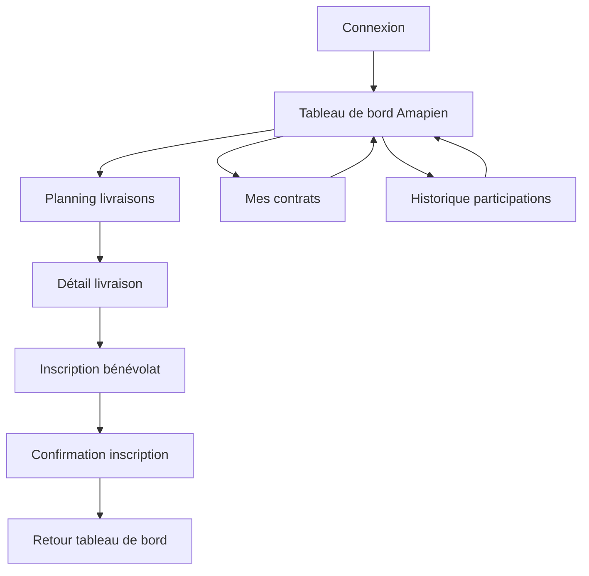
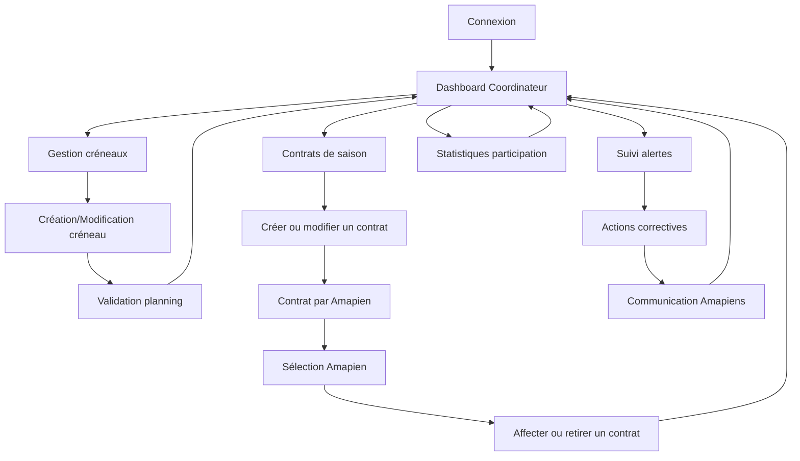

# Interface Utilisateur

## Vue d'ensemble de l'interface

L'interface utilisateur de l'applicatif s'articule autour d'une navigation contextuelle adaptée aux différents profils d'utilisateurs. Elle privilégie la simplicité d'utilisation pour encourager la participation bénévole tout en offrant des outils de gestion complets aux coordinateurs.

### Principes directeurs
- **Accessibilité prioritaire** : Interface simple et intuitive pour tous les âges et niveaux techniques
- **Contextualisation des vues** : Adaptation automatique selon le profil utilisateur (Amapien/Coordinateur)
- **Feedback visuel immédiat** : Indicateurs clairs des états (inscriptions, alertes, validations)
- **Mobile-first** : Conception optimisée pour les appareils mobiles avec interface responsive

## Écrans et composants

### Écrans concernés
- **Accueil public** : Page d'accueil non authentifiée avec présentation de Amap
- **Recherche AMAP** : Interface de recherche et préinscription aux organisations
- **Connexion** : Interface d'authentification et point d'entrée de l'application
- **Tableau de bord** : Vue d'accueil contextuelle selon le profil utilisateur
- **Mes contrats** : Consultation personnelle des contrats et de leurs dates utiles
- **Contrats de saison** : Définition des contrats utilisables par l'AMAP avant leur affectation aux membres
- **Planning des livraisons** : Interface de consultation et Gestion des livraisons
- **Inscription bénévolat** : Formulaire d'inscription aux créneaux de préparation
- **Gestion des alertes** : Interface de suivi des inscriptions au niveau des livraisons
- **Historique participations** : Suivi personnel des engagements
- **Contrat par Amapien** : Affectation et retrait des contrats par le coordinateur
- **Feuilles d'émargement** : Génération, prévisualisation et gestion des documents de présence
- **Suivi temps réel** : Monitoring des présences et récupérations pendant la livraison
- **Création d'organisation** : Formulaire de demande de création d'organisation avec validation administrative
- **Gestion des utilisateurs** : Interface d'ajout et gestion des membres de l'organisation

## Organisation contextuelle

### Vue Volontaire
L'interface privilégie la simplicité et l'information essentielle :
- **Navigation principale** : Accès direct au planning et à l'inscription bénévolat
- **Tableau de bord personnel** : Prochaines livraisons, engagements bénévoles, historique
- **Mes contrats** : Vue dédiée regroupant les contrats actifs, à venir et terminés
- **Actions directes** : Boutons [S'INSCRIRE] et [SE DÉSINSCRIRE] visibles sur tous les écrans
- **Indicateurs visuels** : Statut des inscriptions (confirmé, en attente, complet)
- **Notifications configurables** : Rappels selon les préférences utilisateur personnalisées

### Vue Coordinateur
L'interface coordinateur offre des outils de gestion avancés :
- **Dashboard global** : Vue d'ensemble des livraisons, alertes et statistiques
- **Gestion des livraisons** : Création, modification et suivi des besoins en bénévoles
- **Gestion des contrats de saison** : Consultation, création et modification des contrats de l'AMAP avec leurs référents et compteurs d'Amapiens
- **Gestion des contrats membres** : Consultation des Amapiens, affectation de plusieurs contrats et retrait d'un contrat
- **Système d'alertes** : Monitoring automatique des seuils minimum avec actions correctives
- **Outils de communication** : Diffusion de messages aux Amapiens et relances ciblées
- **Gestion des utilisateurs** : Ajout, modification et suppression des membres de l'organisation
- **Administration** : Configuration de l'organisation et gestion des rôles

## Interactions utilisateur

### 1. Inscription/Désinscription directe
- **Actions disponibles** : [S'INSCRIRE] pour les créneaux disponibles, [SE DÉSINSCRIRE] pour les créneaux où l'utilisateur est inscrit
- **Comportement** : Action immédiate en un clic, sans modal ni confirmation supplémentaire
- **Toggle automatique** : Basculement automatique entre les deux états selon le statut d'inscription
- **Validation** : Vérification automatique des contraintes (capacité, unicité, délai limite)
- **Feedback** : Mise à jour immédiate de l'interface et message de confirmation temporaire
- **Notifications** : Application automatique des préférences de notification configurées par l'utilisateur

### 2. Alerte minimum non atteint
- **Déclencheur** : Seuil critique détecté automatiquement (< x inscrits 48h avant)
- **Comportement** : Affichage badge rouge sur le créneau + notification push/email
- **Actions disponibles** : Bouton "Relancer les Amapiens" (coordinateur) ou "S'inscrire d'urgence" (Amapien)
- **Feedback** : Indicateur de progression temps réel jusqu'au seuil minimum

### 3. Consultation du planning
- **Déclencheur** : Accès depuis menu principal ou tableau de bord
- **Comportement** : Affichage calendrier mensuel avec indicateurs colorés par statut
- **Navigation** : Sélection semaine/mois avec détail au clic sur une livraison
- **Feedback** : Codes couleurs : vert (complet), orange (à risque), rouge (critique)

### 4. Gestion des livraisons (coordinateur)
- **Déclencheur** : Accès depuis dashboard coordinateur
- **Comportement** : Interface de création/modification avec paramètres (date, horaire, minimum requis)
- **Validation** : Contrôles de cohérence (date future, horaires logiques, minimum >= 1)
- **Feedback** : Prévisualisation impact sur planning existant avant validation

### 5. Génération feuille d'émargement (coordinateur)
- **Déclencheur** : Bouton "Générer émargement" sur interface de livraison (disponible 2h avant)
- **Comportement** : Modal de sélection des types d'émargement (bénévoles/paniers) avec prévisualisation
- **Options** : Choix individual ou combiné, format PDF A4, options d'impression
- **Feedback** : Indicateur de génération en cours + téléchargement automatique du PDF

### 6. Suivi temps réel présences (coordinateur)
- **Déclencheur** : Interface "Suivi livraison" active pendant la session
- **Comportement** : Tableau de bord avec état temps réel des bénévoles (présent/absent) et des paniers (récupéré/en attente)
- **Actions** : Boutons rapides "Marquer présent", "Marquer absent" et "Confirmer récupération", avec accès direct au téléphone ou à l'email du membre si besoin
- **Feedback** : Codes couleurs et compteurs temps réel des présences et récupérations

### 7. Synchronisation post-livraison (coordinateur)
- **Déclencheur** : Interface "Finaliser livraison" accessible après clôture des créneaux
- **Comportement** : Écran de saisie des validations papier avec mise à jour simple des statuts bénévoles (présent/absent) et paniers (récupéré/non récupéré)
- **Feedback** : Indicateurs de synchronisation et récapitulatif final des présences et récupérations

## Validation et feedback

### Système de notifications
- **Gestion centralisée** : Configuration exclusive dans les préférences utilisateur
- **Rappels personnalisés** : 24h/2h/30min avant selon les préférences individuelles
- **Notifications push** : Selon les canaux activés (push, email)
- **Feedback d'actions** : Confirmations immédiates d'inscription/désinscription
- **Alertes urgences** : Si activées dans les préférences pour créneaux critiques
- **Messages contextuels** : Informations inline lors des actions

### Codes couleurs standardisés
- **Vert** : Créneau complet ou action validée
- **Orange** : Attention requise (proche du minimum, date limite approche)
- **Rouge** : Situation critique (minimum non atteint, action requise)
- **Bleu** : Information neutre (nouvelles livraisons, modifications planning)

### Indicateurs de progression
- **Jauges de remplissage** : Visualisation du ratio inscrits/minimum requis par créneau
- **Barres de progression temporelle** : Temps restant avant fermeture des inscriptions
- **Compteurs dynamiques** : Mise à jour temps réel des places disponibles

## Navigation entre écrans

### Flux principal Volontaire

### Flux principal Coordinateur

**Description des flux :** La navigation privilégie un parcours linéaire simple du tableau de bord vers l'inscription bénévole et la consultation des contrats. La navigation Coordinateur offre un hub central (dashboard) avec accès direct aux différents outils de gestion, y compris la définition des contrats de saison puis leur affectation aux Amapiens, et retour systématique au point de contrôle principal.

## Responsivité et adaptation

### Adaptation mobile (< 768px)
- **Navigation** : Menu hamburger avec priorité aux actions fréquentes
- **Planning** : Vue liste verticale remplaçant le calendrier
- **Inscriptions** : Modals plein écran pour les formulaires
- **Tableaux** : Cartes empilées remplaçant les tableaux multi-colonnes

### Adaptation tablette (768px - 1024px)
- **Layout hybride** : Sidebars rétractables et contenu principal adaptatif
- **Planning** : Vue calendaire simplifiée avec détails en sidebar
- **Dashboard** : Widgets redimensionnables avec priorité aux alertes

### Adaptation desktop (> 1024px)
- **Interface complète** : Toutes les fonctionnalités visibles simultanément
- **Multi-panels** : Gestion simultanée de plusieurs créneaux
- **Raccourcis clavier** : Navigation rapide pour les coordinateurs expérimentés

## Références et cohérence

### Documentation liée
- **Fonctionnel** : `../README.md` - Processus métier et règles de gestion
- **Spécifications détaillées** : `../specifications-detaillees.md` - Traitements par profil utilisateur
- **Architecture** : `../../architecture/data-model.md` - Entités DELIVERY, DELIVERY_CONTRACT, MEMBER_SLOT, MEMBER
