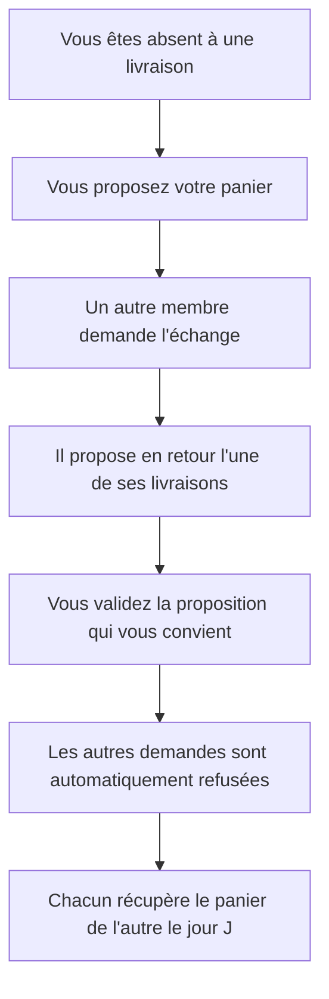

# Échanger un panier

## À quoi ça sert

En cas d'absence, échanger votre panier avec un autre membre. L'échange est **réciproque** :
vous cédez votre panier d'une livraison où vous êtes absent, et vous récupérez en retour le
panier d'un autre membre sur une livraison où c'est lui qui est absent. L'échange évite qu'un
panier soit perdu.

## Comment fonctionne un échange

## Proposer son panier

1. Ouvrez l'écran des **échanges de paniers**.
2. Touchez **[PROPOSER UN ÉCHANGE]**.
3. Sélectionnez la **livraison** que vous souhaitez échanger.
4. Indiquez vos **disponibilités** dans le motif (par exemple « absent le 31 ; dispo les 14 et
   21 février »). C'est utile pour que les autres membres vous proposent une date qui convient.
5. Touchez **[PROPOSER]**.

Votre proposition apparaît dans **« Mes propositions en cours »** avec l'état **🟡 En attente**.

> **Panier partagé** : si vous partagez un panier avec d'autres familles (en alternance), seules
> **les distributions où c'est votre tour** apparaissent dans la liste — vous ne pouvez échanger
> que les paniers qui vous reviennent. Il en va de même pour le panier que vous proposez en retour
> lors d'une demande.

## Demander un échange

1. Dans **« Échanges disponibles »**, repérez un panier proposé.
2. Touchez **[DEMANDER ÉCHANGE]**.
3. **Choisissez la livraison que vous proposez en retour** (l'un de vos paniers à venir).
4. Touchez **[ENVOYER]**.

Le membre qui a proposé le panier reçoit votre demande et choisira de la valider ou non.

## Valider ou refuser les demandes reçues

Lorsqu'un membre vous propose un échange, vous recevez une notification.

1. Sur votre proposition, touchez **[VOIR LES DEMANDES]**.
2. Chaque demande indique **le panier proposé en retour** et la date de la demande.
3. Touchez **[VALIDER]** sur la demande retenue, ou **[REFUSER]**.

> Quand vous **validez** une demande, l'échange est confirmé et **toutes les autres demandes en
> attente sont automatiquement refusées**. Quand vous **refusez** une demande, votre proposition
> reste ouverte pour les autres membres.

## Annuler sa proposition

Sur votre proposition, touchez **[ANNULER]**. Les demandes en attente sont alors refusées.

## Vue d'ensemble et suivi

- La page d'accueil affiche une carte **Échanges de paniers** rappelant les propositions à
  valider, vos demandes en attente et vos échanges confirmés.
- **[VUE D'ENSEMBLE]** ouvre un tableau de tous les échanges en cours de l'AMAP, exportable en
  fichier CSV.
- **[HISTORIQUE DÉTAILLÉ]** liste vos échanges passés avec les deux paniers échangés.

## Voir aussi

- [Mes livraisons et l'inscription comme bénévole](01-mes-livraisons.md)
- [Mes notifications et préférences](05-notifications-preferences.md)
